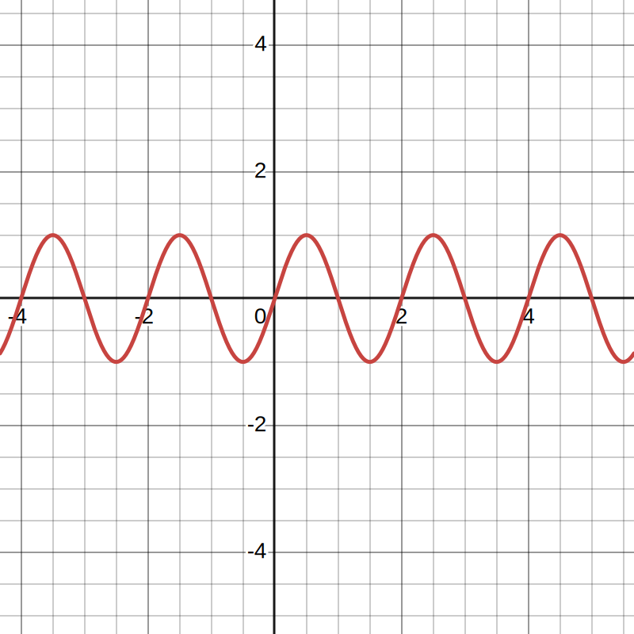
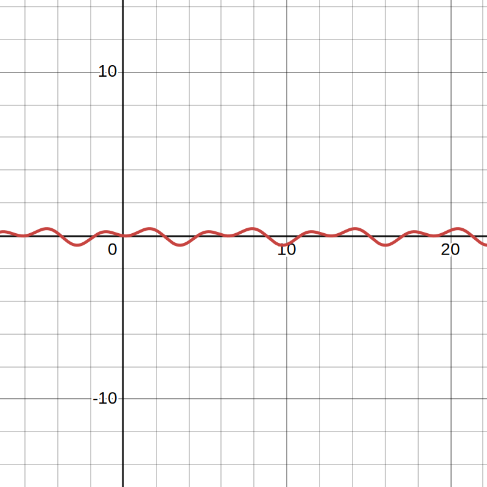
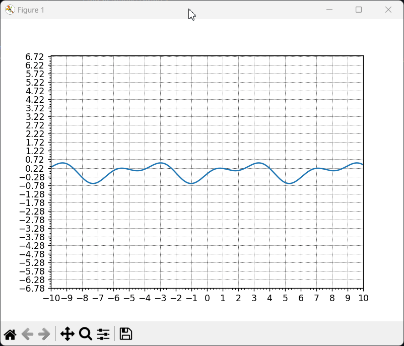

# Sine waves

_Sine waves_ - these are oscillators that are constantly moving back and forth between two different values. This is useful because we know for sure that at whatever point in time we take a sample of our wave, it will always be somewhere between its peaks. The peak value of a wave is called its amplitude. Since the amplitude of the base wave is $\alpha$, we can easily change it to any other wave by multiplying the wave by the peak value we want.

**$$\alpha \cdot \sin(x)$$**

The distance between the two peaks of a wave is called its Wavelength. The smaller the wavelength, the faster the signal repeats. To get the desired wavelength, we can convert it to Frequency, which is the rate at which the wave repeats every second: $\omega = \frac{2\pi}{wavelength}$. Fortunately, we can get the frequency of our wave by multiplying $\omega$ by our positional coordinate: $\alpha \cdot \sin(x \cdot \omega)$. With a wavelength equal to one, our wave now makes a complete repetition between zero and one. And if we consider the $x$-axis to be time, our wave repeats every second. This is our basic wave equation, but it's not very useful without another important component: phase.

To move our wave forward in time, we need to add time as a second variable and add it to the inner part of our wave function: $f(x , t) = \alpha \cdot \sin(x \cdot \omega + t \cdot \varphi)$. We can then control the speed of our wave by expressing the speed as a phase constant $\varphi = \frac{2\pi \cdot speed}{wavelength}$, and then multiplying it by our time variable $f(x,t) = \alpha \cdot \sin(x \cdot \omega + t \cdot \varphi)$.

One wave is boring, but many waves is a lot of waves. The sum of sines is clear enough: it is the sum of sine waves. If you add two identical waves together, nothing interesting happens. But if you add a wave with a wave with different amplitude, frequency, and speed, we start to see more interesting patterns.

**$$a_1 \cdot \sin(x \cdot \omega_1 + t \cdot \varphi_1) + a_2 \cdot \sin(x \cdot \omega_2 + t \cdot \varphi_2)$$**

The more waves we put together, the more detailed wave we get:

$$f(x, t) = \sum_{i=1}^{N} \alpha_i \cdot \sin(x \cdot \omega_i + t \cdot \varphi_i)$$

where:

- $N$ - number of summands;
- $\alpha_i$ - amplitude of the $i$-th wave;
- $\omega_i$ is the frequency of the $i$-th wave.
- $\varphi_i$ - phase of the $i$-th wave.

## Code realization

The presented code `main.py` performs an animation of superimposition of two sine waves with different parameters. The code includes the following main components:

1. `Parameters` - a class that stores the wave parameters such as amplitude, frequency and phase for each wave, as well as an array of time values.
2. `wave()` is a function that computes the value of the wave function for given coordinates $x$ and time $t$ using the wave parameters.
3. initialize $figure$ and $axes$ for visualization.
4. Creating $x$-coordinates for the wave display.
5. Defining the `update()` function that updates the graph at each animation step.
6. Creating and running an animation using `animation.FuncAnimation()`.
7. Customize the appearance of the graph, including the grid, axis captions, and range limit.

You can change wave parameters such as amplitude, frequency and phase in the `Parameters` class. This allows you to observe how the final waveform changes when waves with different characteristics are superimposed.

### Preview

